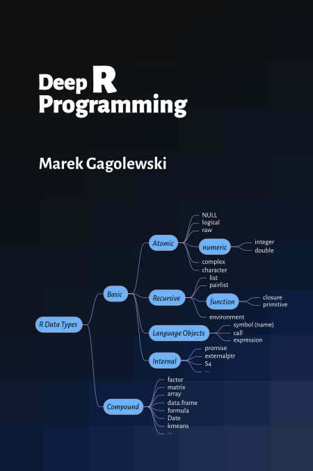

<!-- NOTE EDIT in *-src; *-public is a clone! -->

# [Deep R Programming](https://deepr.gagolewski.com/)

*Deep R Programming* is a comprehensive and in-depth introductory course on one of the most popular languages for data science. It equips ambitious students, professionals, and researchers with the knowledge and skills to become independent users of this potent environment so that they can tackle any problem related to data wrangling and analytics, numerical computing, statistics, and machine learning.

For many students around the world, educational resources are hardly
affordable. Therefore, I have has decided that this book should remain
an independent, non-profit, open-access project. You can read it at:

* <https://deepr.gagolewski.com/> (a browser-friendly version)
* <https://deepr.gagolewski.com/deepr.pdf> (PDF)

You can also order a
[paper copy](https://deepr.gagolewski.com/order-paper-copy.html).

Whilst, for some people, the presence of a "designer tag" from a
major publisher might still be a proxy for quality, it is my hope
that this publication will prove useful to those who seek knowledge for
knowledge's sake.

**Please spread the news about this project.**

Consider citing this book as:
[Gagolewski M.][1] (2024), *Deep R Programming*, Melbourne,
DOI: [10.5281/zenodo.7490464](https://dx.doi.org/10.5281/zenodo.7490464),
ISBN: 978-0-6455719-2-9,
URL: <https://deepr.gagolewski.com/>.

Any remarks and bug fixes are appreciated. Please submit them via
this repository's *Issues* tracker. Thank you.

## About the Author

[Marek Gagolewski][1] is currently an Associate Professor
in Data Science at the Faculty of Mathematics and Information Science,
Warsaw University of Technology.

His research interests are related to data science, in particular: modelling
complex phenomena, developing usable, general-purpose algorithms, studying
their analytical properties, and finding out how people use, misuse,
understand, and misunderstand methods of data analysis in research, commercial,
and decision-making settings.

He's an author of 95+ publications, including journal papers
in outlets such as *Proceedings of the National Academy of Sciences (PNAS)*,
*Journal of Statistical Software*, *The R Journal*, *Information Fusion*,
*International Journal of Forecasting*, *Statistical Modelling*,
*Physica A: Statistical Mechanics and its Applications*,
*Information Sciences*, *Knowledge-Based Systems*,
*IEEE Transactions on Fuzzy Systems*, and *Journal of Informetrics*.

In his "spare" time, he writes books for his students
(check out [*Minimalist Data Wrangling with Python*](https://datawranglingpy.gagolewski.com/))
and [develops](https://github.com/gagolews) open-source software for data analysis, such as
[`stringi`](https://stringi.gagolewski.com/) (one of the most often downloaded
R packages) and
[`genieclust`](https://genieclust.gagolewski.com/) (a fast and robust
hierarchical clustering algorithm in both Python and R).

--------------------------------------------------------------------------------

Copyright (C) 2022–2024, [Marek Gagolewski][1]. Some rights reserved.

This material is licensed under the Creative Commons
[Attribution-NonCommercial-NoDerivatives 4.0 International][2] License
(CC BY-NC-ND 4.0).

[1]: https://www.gagolewski.com/
[2]: https://creativecommons.org/licenses/by-nc-nd/4.0
